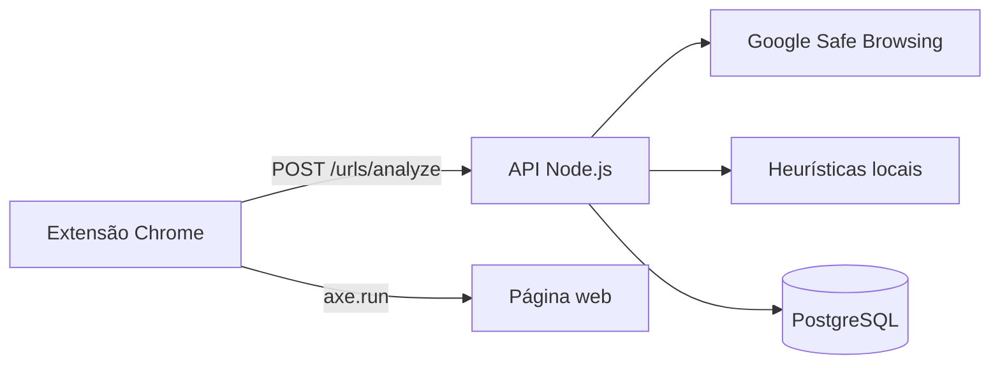

# Sentinela APL — Verificador de Golpe

Extensão para navegador e API backend que ajudam a **identificar páginas potencialmente fraudulentas** e a **auditar acessibilidade** de sites visitados. Projeto integrador entre as matérias de Desenvolvimento Web II, Engenharia de Software I e Projeto Aplicado I — IFC.

## Visão geral

O fluxo principal funciona assim:

1. A extensão Chrome injeta o [axe-core](https://github.com/dequelabs/axe-core) na página visitada e executa uma auditoria de acessibilidade.
2. O relatório de violações e a URL atual são enviados para a API local.
3. A API consulta o **Google Safe Browsing** e, em seguida, aplica **heurísticas locais** sobre a URL.
4. O resultado de segurança é persistido no **PostgreSQL** (quando o banco está disponível).
5. Se a URL for considerada perigosa, a extensão exibe um **overlay de alerta** bloqueando a navegação.



## Estrutura do repositório

```
verificador_golpe/
├── api/                    # Backend Node.js (Express)
│   └── src/
│       ├── app.js          # Aplicação Express com rotas e middlewares
│       ├── server.js       # Ponto de entrada (npm run dev)
│       ├── config/         # Conexão PostgreSQL
│       ├── controllers/
│       ├── services/       # Google Safe Browsing + heurísticas + persistência
│       ├── routes/
│       ├── middlewares/
│       └── utils/
└── extension/              # Extensão Chrome (Manifest V3)
    ├── manifest.json
    ├── content.js          # Lógica principal na página
    ├── axe.min.js          # Biblioteca de auditoria de acessibilidade
    └── api_server.py       # Legado — não utilizado pelo fluxo atual
```

## Pré-requisitos

| Ferramenta | Versão sugerida |
|------------|-----------------|
| [Node.js](https://nodejs.org/) | 18+ |
| [PostgreSQL](https://www.postgresql.org/) | 14+ |
| [Google Chrome](https://www.google.com/chrome/) | Atual |
| Conta Google Cloud | Para a Safe Browsing API |

## Configuração

### 1. Chave da Google Safe Browsing API

1. Acesse o [Google Cloud Console](https://console.cloud.google.com/).
2. Crie ou selecione um projeto.
3. Ative a API **Safe Browsing API**.
4. Crie uma chave de API (API Key) e restrinja o uso quando possível.

### 2. Banco de dados PostgreSQL

Crie o banco e a tabela utilizada pela API:

```sql
CREATE TABLE url_analyses (
    id SERIAL PRIMARY KEY,
    url TEXT NOT NULL,
    is_danger BOOLEAN NOT NULL,
    status VARCHAR(100) NOT NULL,
    reason TEXT,
    accessibility_violations JSONB DEFAULT '[]'::jsonb,
    created_at TIMESTAMP DEFAULT CURRENT_TIMESTAMP
);
```

### 3. Variáveis de ambiente

Na pasta `api/`, crie o arquivo `.env` (não versionado):

```env
# Servidor
PORT=3000

# Google Safe Browsing
GOOGLE_API_KEY=sua_chave_aqui

# PostgreSQL
DB_USER=postgres
DB_HOST=localhost
DB_NAME=meubanco
DB_PASSWORD=sua_senha
DB_PORT=5432
```

> **Importante:** nunca commite o arquivo `.env` com credenciais reais.

### 4. API Node.js

```bash
cd api
npm install
```

Instale também as dependências referenciadas no código mas ainda não listadas no `package.json`:

```bash
npm install helmet express-rate-limit winston
```

Inicie o servidor em modo desenvolvimento:

```bash
npm run dev
```

Verifique se a API responde:

```bash
curl http://localhost:3000/api/status
```

Resposta esperada:

```json
{
  "sucesso": true,
  "mensagem": "API do SentryVZN operando normalmente.",
  "timestamp": "..."
}
```

> **Nota de desenvolvimento:** o arquivo `api/src/app.js` contém todas as rotas e middlewares. O `server.js` atual sobe um Express mínimo **sem montar** essas rotas. Para o fluxo completo funcionar, o `server.js` deve importar e escutar o `app` exportado por `app.js`, por exemplo:
>
> ```js
> const app = require('./app');
> const PORT = process.env.PORT || 3000;
> app.listen(PORT, () => { /* ... */ });
> ```

### 5. Extensão Chrome

1. Abra `chrome://extensions/`.
2. Ative o **Modo do desenvolvedor**.
3. Clique em **Carregar sem compactação**.
4. Selecione a pasta `extension/` do repositório.
5. Com a API rodando em `http://localhost:3000`, navegue em qualquer site para disparar a verificação.

## API

### `GET /api/status`

Health check da API.

### `POST /urls/analyze`

Analisa a URL informada e persiste o resultado no banco.

**Corpo da requisição:**

```json
{
  "url": "https://exemplo.com/pagina",
  "accessibility_report": []
}
```

| Campo | Tipo | Obrigatório | Descrição |
|-------|------|-------------|-----------|
| `url` | string | Sim | URL da página (http ou https) |
| `accessibility_report` | array | Não | Violações retornadas pelo axe-core |

**Resposta de sucesso (200):**

```json
{
  "analysis_id": 1,
  "security": {
    "is_danger": false,
    "status": "Seguro",
    "reason": "Nenhuma ameaça detectada localmente ou nos bancos de dados."
  },
  "accessibility": {
    "report_received": true,
    "violations_count": 3
  }
}
```

**Possíveis status de segurança:**

| Status | Significado |
|--------|-------------|
| `GOLPE CONFIRMADO` | URL na lista negra do Google Safe Browsing |
| `Aparência Suspeita (Heurística)` | Padrões estruturais suspeitos na URL |
| `Erro de Formato` | URL inválida ou ilegível |
| `Seguro` | Nenhuma ameaça detectada nos motores ativos |

### Heurísticas locais (segunda camada)

Aplicadas quando o Google Safe Browsing não encontra ameaças:

- Domínio é um endereço IP (ex.: `http://192.168.0.1/...`)
- Três ou mais hífens no hostname
- TLDs frequentemente associados a abuso: `.tk`, `.ml`, `.ga`, `.cf`, `.gq`, `.xyz`

## Extensão

| Recurso | Descrição |
|---------|-----------|
| Detecção de golpes | Overlay vermelho com opções **Sair** e **Ignorar aviso** |
| Acessibilidade | Auditoria via axe-core em cada página (`document_idle`) |
| Permissões | `activeTab` e `<all_urls>` para content scripts |

A extensão envia requisições para `http://localhost:3000/urls/analyze`. A API precisa estar em execução na mesma máquina.

## Scripts disponíveis

| Comando | Pasta | Descrição |
|---------|-------|-----------|
| `npm run dev` | `api/` | Inicia o servidor com nodemon |
| `npm test` | `api/` | Ainda não implementado |

## Limitações conhecidas

- **Testes automatizados:** não implementados.
- **Histórico na UI:** a API persiste análises no PostgreSQL, mas a extensão ainda não exibe histórico ao usuário.
- **Falha do banco:** se o PostgreSQL estiver indisponível, o alerta de segurança ainda é retornado; apenas a persistência falha silenciosamente.
- **`extension/api_server.py`:** backend FastAPI legado, mantido no repositório mas **não utilizado** pelo `content.js` atual.
- **Dependências:** `helmet`, `express-rate-limit` e `winston` são usados no código e precisam ser instaladas manualmente até serem adicionadas ao `package.json`.

## Contribuindo

1. Crie uma branch a partir de `main`.
2. Faça alterações focadas e teste localmente (API + extensão).
3. Abra um Pull Request descrevendo o que mudou e como validar.

## Licença

ISC (conforme `api/package.json`). Ajuste conforme a política do projeto acadêmico.

## Equipe

Projeto integrador entre as matérias de Desenvolvimento Web II, Engenharia de Software I e Projeto Aplicado I — IFC. Repositório: [github.com/Victor-Casagrande/verificador_golpe](https://github.com/Victor-Casagrande/verificador_golpe).
