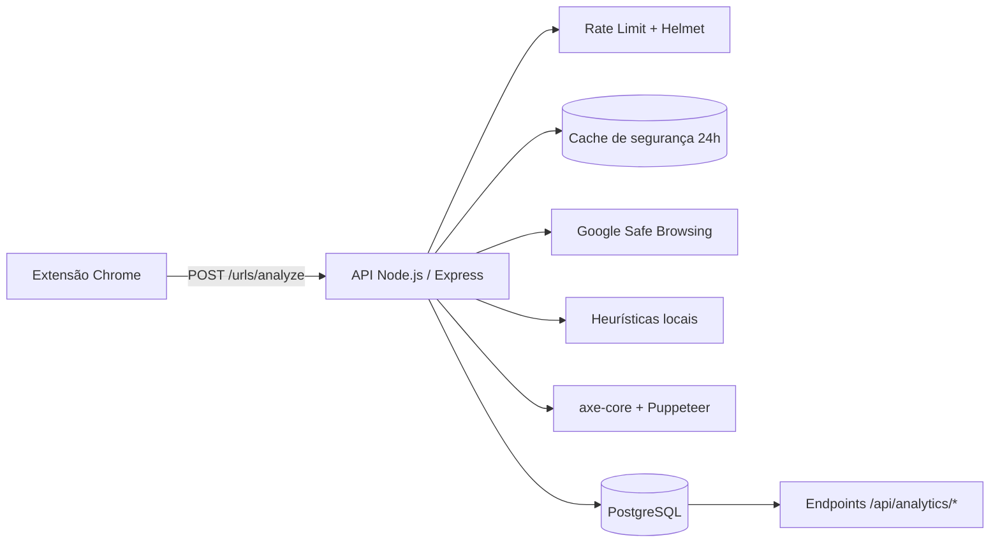

# Sentinela APL — Verificador de Golpe

Extensão para navegador e API backend que ajudam a **identificar páginas potencialmente fraudulentas** e a **auditar a acessibilidade** dos sites visitados. Projeto integrador das matérias de Desenvolvimento Web II, Engenharia de Software I e Projeto Aplicado I — IFC.

## Visão geral

Fluxo principal de uma requisição:

1. A extensão Chrome (Manifest V3) intercepta a navegação do usuário e dispara `POST /urls/analyze` para a API local.
2. A API consulta o **cache de segurança** (24 h, persistido no PostgreSQL). Em caso de _miss_, chama o **Google Safe Browsing** e, na sequência, aplica **heurísticas locais** sobre a URL.
3. Em paralelo, executa o **axe-core via Puppeteer** (Chromium headless) para auditar acessibilidade. Se a auditoria do servidor falhar, aceita um relatório de fallback enviado pelo cliente.
4. As notas (`accessibility_score` e `quality_rating`) são calculadas a partir das violações ponderadas por impacto e persistidas em `url_analyses`.
5. Se a URL for considerada perigosa, a extensão exibe um **overlay vermelho** bloqueando a página com botões para sair ou ignorar.



> A API é resiliente a falhas do PostgreSQL: o alerta de segurança e a nota de acessibilidade continuam sendo devolvidos para a extensão mesmo com o banco fora do ar — apenas o histórico/persistência é marcado como indisponível na resposta (`persistence.persisted: false`) e o estado é refletido em `GET /api/status`.

## Estrutura do repositório

```
verificador_golpe/
├── docker-compose.yml        # API + PostgreSQL para a equipe
├── .env.example              # Modelo de variáveis (copiar para .env)
├── db/init/                  # SQL aplicado na 1ª subida do Postgres
│   ├── 01-schema.sql         # Tabela url_analyses
│   ├── 02-auth-history-reports.sql
│   ├── 03-oauth.sql          # OAuth + usuários de teste
│   └── 04-axe-analytics.sql  # site_host, quality_rating, axe_source
├── api/                      # Backend Node.js (Express 5)
│   ├── Dockerfile            # node:20 + chromium para Puppeteer
│   ├── package.json
│   ├── scripts/
│   │   ├── gerarJWT.js       # Gera JWT local para testes manuais
│   │   └── test-urls-local.js
│   ├── tests/                # Testes unit + integration (node:test)
│   └── src/
│       ├── app.js            # Rotas, middlewares (helmet, cors, rate-limit)
│       ├── server.js         # Bootstrap + shutdown gracioso do axe
│       ├── config/           # database, swagger, oauthProviders
│       ├── controllers/      # verificação, auth, oauth, history, reports, analytics
│       ├── middlewares/      # auth, validações, rate-limit, error handler
│       ├── repositories/     # acesso ao PostgreSQL
│       ├── routes/           # definição das rotas Express
│       ├── services/         # verificationService, axeService, oauthService, ...
│       ├── utils/            # heurísticas, axeViolations, devMode, jwt, logger
│       └── docs/paths/       # anotações OpenAPI para o Swagger
└── extension/                # Extensão Chrome (Manifest V3)
    ├── manifest.json
    └── content.js
```

## Pré-requisitos

| Ferramenta                                         | Versão sugerida | Obrigatório para                          |
| -------------------------------------------------- | --------------- | ----------------------------------------- |
| [Docker](https://www.docker.com/) + Docker Compose | Atual           | Setup recomendado (API + banco)           |
| [Node.js](https://nodejs.org/)                     | 20+             | Desenvolvimento local sem Docker          |
| [PostgreSQL](https://www.postgresql.org/)          | 16+             | Desenvolvimento local sem Docker          |
| [Google Chrome / Chromium](https://www.google.com/chrome/) | Atual   | Extensão + Puppeteer (axe-core servidor)  |
| Conta Google Cloud                                 | —               | Google Safe Browsing API                  |

## Início rápido com Docker (recomendado)

Forma mais simples para contribuidores subirem **API + PostgreSQL** com a mesma configuração e Chromium já instalado dentro do container.

### 1. Variáveis de ambiente

Na **raiz do repositório**:

```bash
cp .env.example .env
```

Edite `.env` e preencha `GOOGLE_API_KEY` com sua chave do Google Safe Browsing.

### 2. Subir os serviços

```bash
docker compose up --build
```

Em segundo plano:

```bash
docker compose up --build -d
```

Sempre que houver alterações em `db/init/`, derrube o volume antes de subir novamente para evitar dessincronização do schema:

```bash
docker compose down -v
docker compose up --build
```

### 3. Validar

```bash
curl http://localhost:3000/api/status
```

### Comandos úteis

| Comando                      | Descrição                                        |
| ---------------------------- | ------------------------------------------------ |
| `docker compose logs -f api` | Logs da API                                      |
| `docker compose logs -f db`  | Logs do PostgreSQL                               |
| `docker compose down`        | Para os containers                               |
| `docker compose down -v`     | Para os containers e **apaga o volume do banco** |

### Serviços

| Serviço | Container       | Porta | Descrição                                       |
| ------- | --------------- | ----- | ----------------------------------------------- |
| `api`   | `sentinela-api` | 3000  | Backend Node.js + Chromium (Puppeteer)          |
| `db`    | `sentinela-db`  | 5432  | PostgreSQL 16-alpine                            |

Os schemas são criados automaticamente via `db/init/` na **primeira inicialização** do banco. Se o volume já existia, rode `docker compose down -v` ou aplique manualmente os scripts.

> A extensão Chrome continua rodando no navegador do host e aponta para `http://localhost:3000`. Com Docker, a porta 3000 é publicada no host — não é necessário alterar a extensão.

## Configuração manual (sem Docker)

### 1. Chave da Google Safe Browsing API

1. Acesse o [Google Cloud Console](https://console.cloud.google.com/).
2. Crie ou selecione um projeto.
3. Ative a API **Safe Browsing API**.
4. Crie uma **API Key** e restrinja o uso quando possível.

### 2. Banco de dados PostgreSQL

Execute os scripts em `db/init/` na ordem numérica (01 → 04). O schema final contém:

```sql
CREATE TABLE url_analyses (
    id SERIAL PRIMARY KEY,
    url VARCHAR(2048) NOT NULL,
    user_id INTEGER REFERENCES users(id) ON DELETE SET NULL,
    site_host VARCHAR(255),
    is_danger BOOLEAN NOT NULL,
    status VARCHAR(100) NOT NULL,
    reason TEXT,
    accessibility_violations JSONB DEFAULT '[]'::jsonb,
    accessibility_score INTEGER NOT NULL DEFAULT 0,  -- penalidade
    quality_rating INTEGER NOT NULL DEFAULT 100,    -- 0–100 (maior = melhor)
    axe_source VARCHAR(20) DEFAULT 'server',        -- server | client | skipped
    security_from_cache BOOLEAN DEFAULT FALSE,
    created_at TIMESTAMP DEFAULT CURRENT_TIMESTAMP
);
```

Tabelas adicionais: `users`, `oauth_accounts`, `reports`.

### 3. Variáveis de ambiente

Copie `.env.example` para `.env` na raiz (Docker) ou crie `api/.env` para desenvolvimento local. Use `DB_HOST=localhost` quando o PostgreSQL rodar na máquina host.

Principais variáveis:

| Variável                    | Descrição                                                                |
| --------------------------- | ------------------------------------------------------------------------ |
| `GOOGLE_API_KEY`            | Chave do Google Safe Browsing (obrigatória)                              |
| `JWT_SECRET`                | Segredo para assinar tokens (use string longa e aleatória em produção)   |
| `JWT_EXPIRES_IN`            | Validade dos tokens (padrão `7d`)                                        |
| `GITHUB_*` / `GOOGLE_*`     | Client ID, secret e callback para OAuth                                  |
| `OAUTH_SUCCESS_REDIRECT`    | URL externa para redirect pós-login OAuth (opcional)                     |
| `AXE_ENABLED`               | `true` por padrão; `false` desliga a auditoria axe no servidor           |
| `AXE_TIMEOUT_MS`            | Timeout de navegação e análise (padrão `45000`)                          |
| `PUPPETEER_EXECUTABLE_PATH` | Caminho do Chromium/Chrome. Linux/Docker: `/usr/bin/chromium`            |
| `DB_*`                      | Conexão PostgreSQL                                                       |

> **Importante:** nunca commite o arquivo `.env` com credenciais reais.

### 4. API Node.js

```bash
cd api
npm install
npm run dev
```

Verifique se a API responde:

```bash
curl http://localhost:3000/api/status
```

### 5. Extensão Chrome

1. Abra `chrome://extensions/`.
2. Ative o **Modo do desenvolvedor**.
3. Clique em **Carregar sem compactação**.
4. Selecione a pasta `extension/` do repositório.
5. Com a API rodando em `http://localhost:3000`, navegue em qualquer site para disparar a verificação. O resultado aparece no console (`F12`) e o overlay vermelho é exibido quando `is_danger` for `true`.

## API

Rotas públicas não exigem token. Rotas protegidas usam header:

```
Authorization: Bearer <token_jwt>
```

Para testes locais rápidos, gere um JWT com o segredo do `.env`:

```bash
cd api
node scripts/gerarJWT.js
```

O token é impresso no terminal e pode ser usado em Swagger UI, Postman, curl, etc.

> O `db/init/03-oauth.sql` cria usuários de teste — todos com senha `123456`: `admin@test.com`, `joao@test.com`, `maria@test.com` (e `oauth@test.com`, sem senha, exclusivo para fluxo OAuth).

### `GET /api/status`

Health check da API. Público. Sempre devolve `200` enquanto o processo Node estiver respondendo — mesmo com o PostgreSQL fora do ar — porque o fluxo principal de verificação continua funcionando sem persistência. A saúde das dependências aparece no payload:

```json
{
  "sucesso": true,
  "mensagem": "API do SentryVZN operando normalmente.",
  "timestamp": "2026-05-28T11:55:00.000Z",
  "dependencies": {
    "database": { "ok": true, "latency_ms": 4 }
  }
}
```

Quando o banco está indisponível, `dependencies.database.ok` vira `false` e a mensagem indica modo degradado.

### Documentação interativa (Swagger)

Com a API rodando:

- UI: [http://localhost:3000/api/docs](http://localhost:3000/api/docs)
- JSON OpenAPI: `GET /api/docs.json`

### Autenticação

#### `POST /auth/register`

```json
{
  "name": "Maria Silva",
  "email": "maria@email.com",
  "password": "senha123"
}
```

#### `POST /auth/login`

```json
{
  "email": "maria@email.com",
  "password": "senha123"
}
```

Resposta (registro e login):

```json
{
  "sucesso": true,
  "token": "eyJhbGciOiJIUzI1NiIsInR5cCI6IkpXVCJ9...",
  "user": {
    "id": 1,
    "name": "Maria Silva",
    "email": "maria@email.com"
  }
}
```

#### OAuth (GitHub e Google)

O **e-mail é a chave da conta**: login via GitHub ou Google com o mesmo e-mail unifica o acesso à mesma conta (e ao histórico).

| Rota                                  | Descrição                                       |
| ------------------------------------- | ----------------------------------------------- |
| `GET /auth/oauth/providers`           | Lista provedores configurados                   |
| `GET /auth/oauth/github`              | Inicia login GitHub                             |
| `GET /auth/oauth/google`              | Inicia login Google                             |
| `GET /auth/oauth/{provider}/callback` | Callback — retorna JSON com JWT (ou redireciona |
|                                       | para `OAUTH_SUCCESS_REDIRECT` com `?token=...`) |

Configure no `.env`: `GITHUB_CLIENT_ID`, `GITHUB_CLIENT_SECRET`, `GITHUB_CALLBACK_URL` e equivalentes `GOOGLE_*`.

### `POST /urls/analyze`

Endpoint central. Header `Authorization` é **opcional**: quando presente, vincula a análise ao histórico do usuário.

Fluxo: **(1)** cache de segurança (24 h) → **(2)** Google Safe Browsing → **(3)** heurísticas locais → **(4)** axe-core no servidor (Puppeteer) → **(5)** pontuação e persistência.

Cada chamada grava uma **nova análise** (o mesmo site em datas diferentes pode ter notas diferentes). O cache de 24 h aplica-se **apenas à segurança**; a acessibilidade é sempre reavaliada.

**Corpo da requisição:**

```json
{
  "url": "https://exemplo.com/pagina",
  "accessibility_report": [],
  "dev_mode": false
}
```

| Campo                  | Tipo    | Obrigatório | Descrição                                                                                                                     |
| ---------------------- | ------- | ----------- | ----------------------------------------------------------------------------------------------------------------------------- |
| `url`                  | string  | Sim         | URL da página (http ou https)                                                                                                 |
| `accessibility_report` | array   | Não         | Fallback usado apenas se o axe no servidor falhar (objetos no formato de violações do axe-core)                               |
| `dev_mode`             | boolean | Não         | Quando `true` (ou string `"true"`), inclui `accessibility.detailed_report` com exceções axe-core completas para depuração     |

**Resposta de sucesso (200) — modo padrão:**

```json
{
  "analysis_id": 1,
  "security": {
    "is_danger": false,
    "status": "Seguro",
    "reason": "Nenhuma ameaça detectada localmente ou nos bancos de dados.",
    "from_cache": false
  },
  "accessibility": {
    "report_received": true,
    "violations_count": 2,
    "sanitized_violations_stored": 2,
    "accessibility_score": 11,
    "quality_rating": 89,
    "axe_source": "server",
    "axe_error": null
  },
  "persistence": {
    "persisted": true,
    "error": null
  },
  "cached": false
}
```

O bloco `persistence` indica se a análise foi gravada no banco. Quando o PostgreSQL está indisponível, `persisted` vira `false`, `analysis_id` fica `null` e `error` contém uma mensagem amigável — mas os blocos `security` e `accessibility` permanecem completos e válidos.

**Resposta com `dev_mode: true`** — adiciona `detailed_report` (limitado a 50 violações e 10 nós cada):

```json
{
  "accessibility": {
    "quality_rating": 89,
    "detailed_report": [
      {
        "id": "image-alt",
        "impact": "critical",
        "tags": ["wcag2a", "wcag111"],
        "description": "Images must have alternate text",
        "help": "Images must have alternate text",
        "helpUrl": "https://dequeuniversity.com/rules/axe/4.9/image-alt",
        "nodes": [
          {
            "html": "",
            "target": ["#hero > img"],
            "failureSummary": "Fix any of the following: ...",
            "impact": "critical"
          }
        ]
      }
    ]
  }
}
```

| Métrica               | Significado                                                              |
| --------------------- | ------------------------------------------------------------------------ |
| `quality_rating`      | 0–100 — **maior = melhor** acessibilidade                                |
| `accessibility_score` | Penalidade acumulada — **maior = pior**                                  |
| `axe_source`          | `server` (Puppeteer), `client` (fallback) ou `skipped` (axe desativado)  |

A pontuação pondera violações por impacto: `critical` × 4, `serious` × 3, `moderate` × 2, `minor` × 1, multiplicado pelo número de nós afetados.

### `GET /users/history` (autenticado)

Lista o histórico de análises do usuário logado (cada entrada com `quality_rating`, status e data).

Query params: `limit` (padrão `20`, máx `100`), `offset` (padrão `0`), `url` (filtrar por URL específica).

### `GET /urls/scores/history?url=...`

Timeline pública das notas de uma URL ao longo do tempo (evolução por data). Query: `limit` (padrão `30`, máx `100`).

### `POST /reports` (autenticado)

Envia feedback do usuário sobre uma URL ou análise.

```json
{
  "url": "https://exemplo.com",
  "analysis_id": 1,
  "report_type": "false_positive",
  "comment": "Site legítimo, falso positivo."
}
```

| `report_type`         | Descrição                     |
| --------------------- | ----------------------------- |
| `false_positive`      | Alerta incorreto              |
| `confirmed_scam`      | Golpe confirmado pelo usuário |
| `accessibility_issue` | Problema de acessibilidade    |
| `other`               | Outros                        |

### Rankings públicos

#### `GET /rankings/accessibility/worst?limit=10&min_analyses=1`

Sites com **piores notas** (menor `quality_rating` médio por host).

#### `GET /rankings/accessibility/best?limit=10&min_analyses=1`

Sites com **melhores notas** (maior `quality_rating` médio por host).

#### `GET /rankings/reports/most?limit=10`

Sites com **mais denúncias** dos usuários.

### Analytics (autenticado)

Endpoints agregados para dashboards e relatórios internos. Todos exigem JWT.

| Rota                                            | Descrição                                                                                |
| ----------------------------------------------- | ---------------------------------------------------------------------------------------- |
| `GET /api/analytics/security/global`            | Volumetria total de análises, ameaças, _cache hits_ e divisão Google × Heurísticas       |
| `GET /api/analytics/security/community`         | Estatísticas de feedback (`reports`) cruzadas com a origem da análise                    |
| `GET /api/analytics/security/ranking/hosts`     | Hosts com maior número de análises perigosas (`?limit=N`)                                |
| `GET /api/analytics/accessibility/global`       | Médias globais de `quality_rating`, `accessibility_score` e contagem por `axe_source`    |
| `GET /api/analytics/accessibility/ranking/hosts`| Hosts com pior média de acessibilidade (`?limit=N`)                                      |

**Status de segurança possíveis:**

| Status                            | Significado                                 |
| --------------------------------- | ------------------------------------------- |
| `GOLPE CONFIRMADO`                | URL na lista do Google Safe Browsing        |
| `Aparência Suspeita (Heurística)` | Padrões estruturais suspeitos na URL        |
| `Erro de Formato`                 | URL inválida ou ilegível                    |
| `Seguro`                          | Nenhuma ameaça detectada nos motores ativos |

### Heurísticas locais (segunda camada)

Aplicadas quando o Google Safe Browsing não encontra ameaças (ou está indisponível). Qualquer regra positiva já marca a URL como `Aparência Suspeita (Heurística)`:

| Regra                        | Detalhe                                                                            |
| ---------------------------- | ---------------------------------------------------------------------------------- |
| Endereço IP direto           | Hostname é um IPv4 literal (ex.: `http://192.168.0.1/login`)                       |
| Excesso de hífens            | Três ou mais hífens no hostname (camuflagem de domínio)                            |
| TLD de baixa reputação       | `.tk`, `.ml`, `.ga`, `.cf`, `.gq`, `.xyz`, `.top`, `.pw`                           |
| DNS dinâmico / túnel         | `ngrok.io`, `duckdns.org`, `noip.com`, `ddns.net`, `serveo.net`, `localtunnel.me`  |
| Palavras-chave suspeitas     | `login`, `secure`, `account`, `update`, `banking`, `verify`, `free`, `admin`, ...  |
| Subdomínios excessivos       | Cinco ou mais segmentos no hostname (`a.b.c.d.exemplo.com`)                        |
| URL excessivamente longa     | Mais de 200 caracteres                                                             |

## Extensão

| Recurso            | Descrição                                                                          |
| ------------------ | ---------------------------------------------------------------------------------- |
| Detecção de golpes | Overlay vermelho fullscreen com botões **Sair** e **Ignorar aviso**                |
| Acessibilidade     | Nota gerada pela API (axe-core no servidor); exibida no console via `console.info` |
| Timeout            | `90s` configurados em `SENTRY_CONFIG.TIMEOUT_MS` (cancela `fetch` se exceder)      |
| Permissões         | `activeTab` + `host_permissions: <all_urls>` para rodar em qualquer página         |

A extensão envia requisições para `http://localhost:3000/urls/analyze`. A API precisa estar em execução na mesma máquina; o `accessibility_report` é enviado vazio (a auditoria roda do lado do servidor com Puppeteer).

## Segurança e robustez do servidor

- **`helmet`** com Content Security Policy aplicada por padrão.
- **`cors`** liberado para uso com a extensão.
- **Rate limit** global: `1000` requisições por janela de `15 min`, por usuário autenticado ou IP de origem.
- **Body limit** de `1 MB` em JSON e _form-urlencoded_.
- **Cache de segurança** de 24 h por URL (consulta `url_analyses` antes de chamar APIs externas). A consulta é envolvida em `try/catch`, então uma falha do banco apenas resulta em _cache miss_ — nunca derruba o pipeline.
- **Pool de PostgreSQL resiliente**: handler de `pool.on('error')` evita que conexões ociosas mortas (ex.: Postgres reiniciou) emitam `uncaughtException` e crashem o processo. `connectionTimeoutMillis` curto (5 s) faz o app falhar rápido em ambientes degradados.
- **Persistência tolerante a falhas**: o `INSERT` em `url_analyses` é isolado em `try/catch`. Falhas são logadas pelo `winston` (`[DB-PERSISTENCE]`, com `code` do PG) e propagadas ao cliente como `persistence.persisted: false`, sem afetar o resultado de segurança.
- **Reciclagem do Chromium**: o Puppeteer compartilha uma instância única, recicla a cada 50 páginas e encerra automaticamente após 10 min de inatividade para liberar memória.
- **Request interception** durante o axe-core: imagens, fontes, CSS e mídia são bloqueados para acelerar a auditoria.
- **Shutdown gracioso**: `SIGINT`/`SIGTERM` fecham o Chromium antes de derrubar o servidor.
- **Logging**: `winston` grava em `error.log` (nível _error_) e `combined.log`, além do console. Erros do banco usam o prefixo estruturado `[DB-CACHE]` / `[DB-PERSISTENCE]` para facilitar a triagem.

## Scripts disponíveis

| Comando                                | Pasta  | Descrição                                                              |
| -------------------------------------- | ------ | ---------------------------------------------------------------------- |
| `npm start`                            | `api/` | Inicia o servidor (produção / Docker)                                  |
| `npm run dev`                          | `api/` | Inicia o servidor com `nodemon` (hot reload)                           |
| `npm test`                             | `api/` | Roda testes unitários + integração (`node --test`)                     |
| `npm run test:unit`                    | `api/` | Apenas testes unitários                                                |
| `npm run test:integration`             | `api/` | Apenas testes de integração (supertest contra app em memória)          |
| `npm run test:urls`                    | `api/` | Bate na API em execução com a fixture de URLs (smoke test real)        |
| `npm run jwt`                          | `api/` | Gera um JWT local — interativo, lista usuários do banco                |
| `npm run jwt -- --user-id=1`           | `api/` | Gera JWT direto para um `id` específico (uso em CI)                    |
| `npm run login:simulate`               | `api/` | Simulação interativa do login (e-mail/senha + OAuth opcional)          |
| `docker compose up --build`            | raiz   | Sobe API + PostgreSQL                                                  |

## Testes

```bash
cd api
npm install
npm test
```

Cobertura atual: utilitários de URL (`urlHeuristics`, `validators`), pontuação de acessibilidade, parsing de `dev_mode`, formatação detalhada de violações axe-core, OAuth (state, `buildAuthorizeUrl`, `getConfiguredProviders`, `exchangeCodeForToken`, `handleCallback` com fetch e repositórios mockados, `resolveOrCreateUser`) e rotas críticas (`/urls/analyze`, `/auth/*`, `/rankings/*`, `/users/history`).

Smoke test contra a API em execução (`npm run dev`):

```bash
npm run test:urls
# ou: node scripts/test-urls-local.js
```

Fixtures em `api/tests/fixtures/test-urls.json` (URLs seguras, suspeitas e inválidas).

### Scripts de autenticação manual

Para reproduzir o fluxo completo de login (registro → login → OAuth opcional) com seu próprio e-mail/senha:

```bash
# 1. interativo (pede e-mail, senha, oferece registro automático)
npm run login:simulate

# 2. não interativo (CI / scripts)
npm run login:simulate -- --email=foo@bar.com --password=senha123 --name="Foo Bar"

# 3. inclui o fluxo OAuth (apenas imprime a URL para abrir no browser e cola o token de volta)
npm run login:simulate -- --oauth=github
```

E para gerar um JWT manualmente a partir de um usuário existente no banco:

```bash
# lista usuários e pede para escolher
npm run jwt

# direto
npm run jwt -- --user-id=1
```

Ambos respeitam `JWT_SECRET` do `.env` — nada é hardcoded.

## Limitações conhecidas

- **Histórico na UI:** a API expõe `GET /users/history`, mas a extensão ainda não exibe esse histórico ao usuário.
- **Modo degradado (banco indisponível):** o alerta de segurança e a nota de acessibilidade continuam sendo devolvidos normalmente — a falha agora é sinalizada (`persistence.persisted: false` + `GET /api/status` reportando `database.ok: false`) e logada com `winston`, mas as análises geradas nesse intervalo **não ficam no histórico** quando o Postgres volta. Não há replay automático.
- **`dev_mode` em produção:** o relatório detalhado pode trazer trechos de HTML da página auditada — use apenas em ambientes de desenvolvimento/staging.
- **Puppeteer no host:** sem Docker, o `PUPPETEER_EXECUTABLE_PATH` precisa apontar para um binário compatível do Chrome/Chromium.

## Contribuindo

1. Crie uma branch a partir de `main`.
2. Faça alterações focadas e teste localmente (API + extensão).
3. Abra um Pull Request descrevendo o que mudou e como validar.

## Licença

ISC (conforme `api/package.json`). Ajuste conforme a política do projeto acadêmico.

## Equipe

Projeto integrador entre as matérias de Desenvolvimento Web II, Engenharia de Software I e Projeto Aplicado I — IFC. Repositório: [github.com/Victor-Casagrande/verificador_golpe](https://github.com/Victor-Casagrande/verificador_golpe).
