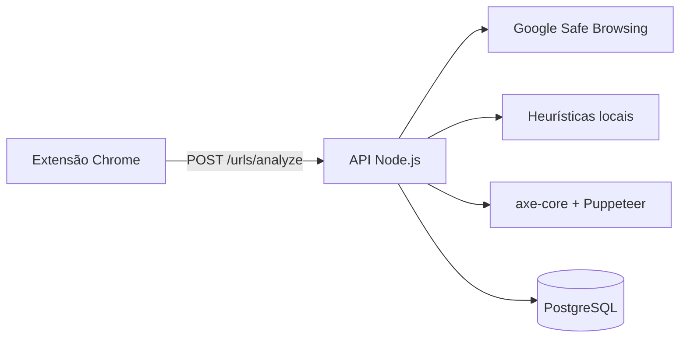

# Sentinela APL — Verificador de Golpe

Extensão para navegador e API backend que ajudam a **identificar páginas potencialmente fraudulentas** e a **auditar acessibilidade** de sites visitados. Projeto integrador entre as matérias de Desenvolvimento Web II, Engenharia de Software I e Projeto Aplicado I — IFC.

## Visão geral

O fluxo principal funciona assim:

1. A extensão Chrome injeta o [axe-core](https://github.com/dequelabs/axe-core) na página visitada e executa uma auditoria de acessibilidade.
2. O relatório de violações e a URL atual são enviados para a API local.
3. A API consulta o **Google Safe Browsing** e, em seguida, aplica **heurísticas locais** sobre a URL.
4. O resultado de segurança é persistido no **PostgreSQL** (quando o banco está disponível).
5. Se a URL for considerada perigosa, a extensão exibe um **overlay de alerta** bloqueando a navegação.



## Estrutura do repositório

```
verificador_golpe/
├── docker-compose.yml      # API + PostgreSQL para a equipe
├── .env.example            # Modelo de variáveis (copiar para .env)
├── db/init/                # Scripts SQL executados na 1ª subida do Postgres
├── api/                    # Backend Node.js (Express)
│   ├── Dockerfile
│   └── src/
│       ├── app.js          # Rotas e middlewares
│       ├── server.js       # Ponto de entrada
│       └── ...
└── extension/              # Extensão Chrome (Manifest V3)
    ├── manifest.json
    ├── content.js
    └── axe.min.js
```

## Pré-requisitos

| Ferramenta | Versão sugerida | Obrigatório para |
|------------|-----------------|------------------|
| [Docker](https://www.docker.com/) + Docker Compose | Atual | Setup recomendado (API + banco) |
| [Node.js](https://nodejs.org/) | 18+ | Desenvolvimento local sem Docker |
| [PostgreSQL](https://www.postgresql.org/) | 14+ | Desenvolvimento local sem Docker |
| [Google Chrome](https://www.google.com/chrome/) | Atual | Extensão |
| Conta Google Cloud | — | Safe Browsing API |

## Início rápido com Docker (recomendado)

Forma mais simples para contribuidores subirem **API + PostgreSQL** com a mesma configuração.

### 1. Variáveis de ambiente

Na **raiz do repositório**:

```bash
cp .env.example .env
```

Edite `.env` e preencha `GOOGLE_API_KEY` com sua chave do Google Safe Browsing.

### 2. Subir os serviços

```bash
docker compose up --build
```

Em segundo plano:

```bash
docker compose up --build -d
```

Relembrar de fazer migrações conforme as alterações, desconstrua o container e remonte-o novamente para evitar dessincronização

```bash
docker compose down -v
```

```bash
docker compose up --build
```

### 3. Validar

```bash
curl http://localhost:3000/api/status
```

### Comandos úteis

| Comando | Descrição |
|---------|-----------|
| `docker compose logs -f api` | Logs da API |
| `docker compose logs -f db` | Logs do PostgreSQL |
| `docker compose down` | Para os containers |
| `docker compose down -v` | Para os containers e **apaga o volume do banco** |

### Serviços

| Serviço | Container | Porta | Descrição |
|---------|-----------|-------|-----------|
| `api` | `sentinela-api` | 3000 | Backend Node.js |
| `db` | `sentinela-db` | 5432 | PostgreSQL 16 |

Os schemas são criados automaticamente via `db/init/` na primeira inicialização do banco. Se o volume do Postgres já existia antes de novas migrations, execute `docker compose down -v` ou rode manualmente os scripts em `db/init/`.

> A extensão Chrome continua rodando no navegador do host e aponta para `http://localhost:3000`. Com Docker, a porta 3000 é publicada no host — não é necessário alterar a extensão.

## Configuração manual (sem Docker)

### 1. Chave da Google Safe Browsing API

1. Acesse o [Google Cloud Console](https://console.cloud.google.com/).
2. Crie ou selecione um projeto.
3. Ative a API **Safe Browsing API**.
4. Crie uma chave de API (API Key) e restrinja o uso quando possível.

### 2. Banco de dados PostgreSQL

Crie o banco e a tabela utilizada pela API:

```sql
CREATE TABLE url_analyses (
    id SERIAL PRIMARY KEY,
    url TEXT NOT NULL,
    is_danger BOOLEAN NOT NULL,
    status VARCHAR(100) NOT NULL,
    reason TEXT,
    accessibility_violations JSONB DEFAULT '[]'::jsonb,
    created_at TIMESTAMP DEFAULT CURRENT_TIMESTAMP
);
```

### 3. Variáveis de ambiente

Copie `.env.example` para `.env` na raiz (Docker) ou crie `api/.env` para desenvolvimento local. Use `DB_HOST=localhost` quando o PostgreSQL rodar na máquina host.

> **Importante:** nunca commite o arquivo `.env` com credenciais reais.

### 4. API Node.js

```bash
cd api
npm install
npm run dev
```

Verifique se a API responde:

```bash
curl http://localhost:3000/api/status
```

### 5. Extensão Chrome

1. Abra `chrome://extensions/`.
2. Ative o **Modo do desenvolvedor**.
3. Clique em **Carregar sem compactação**.
4. Selecione a pasta `extension/` do repositório.
5. Com a API rodando em `http://localhost:3000`, navegue em qualquer site para disparar a verificação.

## API

Rotas públicas não exigem token. Rotas protegidas usam header:

```
Authorization: Bearer <token_jwt>
```

bearerAuth pode ser gerado localmente para testes através do script em `api/api/scripts/gerarJWT.js`

```bash
node gerarJWT.js
```

Resposta contém o JWT gerado para testes locais com Swagger, PostMan, curl e etc.

### `GET /api/status`

Health check da API.

### Autenticação

#### `POST /auth/register`

```json
{
  "name": "Maria Silva",
  "email": "maria@email.com",
  "password": "senha123"
}
```

#### `POST /auth/login`

```json
{
  "email": "maria@email.com",
  "password": "senha123"
}
```

Resposta (registro e login):

```json
{
  "sucesso": true,
  "token": "eyJhbGciOiJIUzI1NiIsInR5cCI6IkpXVCJ9...",
  "user": {
    "id": 1,
    "name": "Maria Silva",
    "email": "maria@email.com"
  }
}
```

#### OAuth (GitHub e Google)

O **e-mail é a chave da conta**: login via GitHub ou Google com o mesmo e-mail unifica o acesso à mesma conta (e ao histórico).

| Rota | Descrição |
|------|-----------|
| `GET /auth/oauth/providers` | Lista provedores configurados |
| `GET /auth/oauth/github` | Inicia login GitHub |
| `GET /auth/oauth/google` | Inicia login Google |
| `GET /auth/oauth/{provider}/callback` | Callback — retorna JSON com JWT |

Configure no `.env`: `GITHUB_CLIENT_ID`, `GITHUB_CLIENT_SECRET`, `GITHUB_CALLBACK_URL` e equivalentes `GOOGLE_*`.

### Documentação interativa (Swagger)

Com a API rodando:

- UI: [http://localhost:3000/api/docs](http://localhost:3000/api/docs)
- JSON OpenAPI: `GET /api/docs.json`

### `POST /urls/analyze`

Fluxo: **(1)** Google Safe Browsing + heurísticas → **(2)** axe-core no servidor (Puppeteer) → **(3)** notas e persistência.

Cada chamada grava uma **nova análise** (o mesmo site em datas diferentes pode ter notas diferentes). O cache de 24h aplica-se **apenas à segurança**; a acessibilidade é sempre reavaliada.

**Corpo da requisição:**

```json
{
  "url": "https://exemplo.com/pagina"
}
```

| Campo | Tipo | Obrigatório | Descrição |
|-------|------|-------------|-----------|
| `url` | string | Sim | URL da página (http ou https) |
| `accessibility_report` | array | Não | Fallback se o axe no servidor falhar |
| `dev_mode` | boolean | Não | Quando `true`, inclui `accessibility.detailed_report` com exceções axe-core detalhadas |

**Resposta de sucesso (200):**

```json
{
  "analysis_id": 1,
  "security": {
    "is_danger": false,
    "status": "Seguro",
    "reason": "...",
    "from_cache": false
  },
  "accessibility": {
    "quality_rating": 89,
    "accessibility_score": 11,
    "violations_count": 2,
    "axe_source": "server"
  },
  "cached": false
}
```

| Métrica | Significado |
|---------|-------------|
| `quality_rating` | 0–100 — **maior = melhor** acessibilidade |
| `accessibility_score` | Penalidade — **maior = pior** |

### `GET /users/history` (autenticado)

Lista o histórico de análises do usuário logado (cada entrada com `quality_rating` e data).

Query params: `limit`, `offset`, `url` (filtrar por URL específica).

### `GET /urls/scores/history?url=...`

Timeline pública das notas de uma URL ao longo do tempo (evolução por data).

### `POST /reports` (autenticado)

Envia feedback sobre uma URL ou análise.

```json
{
  "url": "https://exemplo.com",
  "analysis_id": 1,
  "report_type": "false_positive",
  "comment": "Site legítimo, falso positivo."
}
```

| `report_type` | Descrição |
|---------------|-----------|
| `false_positive` | Alerta incorreto |
| `confirmed_scam` | Golpe confirmado pelo usuário |
| `accessibility_issue` | Problema de acessibilidade |
| `other` | Outros |

### Rankings

#### `GET /rankings/accessibility/worst?limit=10`

Sites com **piores notas** (menor `quality_rating` médio por host). Público.

#### `GET /rankings/accessibility/best?limit=10`

Sites com **melhores notas** (maior `quality_rating` médio por host). Público.

#### `GET /rankings/reports/most?limit=10`

Sites com **mais denúncias** dos usuários. Público.

**Possíveis status de segurança:**

| Status | Significado |
|--------|-------------|
| `GOLPE CONFIRMADO` | URL na lista negra do Google Safe Browsing |
| `Aparência Suspeita (Heurística)` | Padrões estruturais suspeitos na URL |
| `Erro de Formato` | URL inválida ou ilegível |
| `Seguro` | Nenhuma ameaça detectada nos motores ativos |

### Heurísticas locais (segunda camada)

Aplicadas quando o Google Safe Browsing não encontra ameaças:

- Domínio é um endereço IP (ex.: `http://192.168.0.1/...`)
- Três ou mais hífens no hostname
- TLDs frequentemente associados a abuso: `.tk`, `.ml`, `.ga`, `.cf`, `.gq`, `.xyz`

## Extensão

| Recurso | Descrição |
|---------|-----------|
| Detecção de golpes | Overlay vermelho com opções **Sair** e **Ignorar aviso** |
| Acessibilidade | Nota gerada pela API (axe-core no servidor); exibida no console da extensão |
| Permissões | `activeTab` e `<all_urls>` para content scripts |

A extensão envia requisições para `http://localhost:3000/urls/analyze`. A API precisa estar em execução na mesma máquina.

## Scripts disponíveis

| Comando | Pasta | Descrição |
|---------|-------|-----------|
| `npm start` | `api/` | Inicia o servidor (produção / Docker) |
| `npm run dev` | `api/` | Inicia o servidor com nodemon |
| `docker compose up --build` | raiz | Sobe API + PostgreSQL |
| `npm test` | `api/` | Testes unitários + integração |
| `npm run test:unit` | `api/` | Só testes unitários |
| `npm run test:urls` | `api/` | Script contra API local (heurísticas/URLs) |

## Testes

```bash
cd api
npm install
npm test
```

Testar verificação de URLs com a API em execução (`npm run dev`):

```bash
npm run test:urls
# ou: node scripts/test-urls-local.js --base-url=http://localhost:3000
```

Fixtures em `api/tests/fixtures/test-urls.json` (URLs seguras, suspeitas e inválidas).

## Limitações conhecidas
- **Histórico na UI:** a API expõe `GET /users/history`, mas a extensão ainda não exibe histórico ao usuário.
- **Falha do banco:** se o PostgreSQL estiver indisponível, o alerta de segurança ainda é retornado; apenas a persistência falha silenciosamente.
- **`extension/api_server.py`:** backend FastAPI legado, mantido no repositório mas **não utilizado** pelo `content.js` atual.

## Contribuindo

1. Crie uma branch a partir de `main`.
2. Faça alterações focadas e teste localmente (API + extensão).
3. Abra um Pull Request descrevendo o que mudou e como validar.

## Licença

ISC (conforme `api/package.json`). Ajuste conforme a política do projeto acadêmico.

## Equipe

Projeto integrador entre as matérias de Desenvolvimento Web II, Engenharia de Software I e Projeto Aplicado I — IFC. Repositório: [github.com/Victor-Casagrande/verificador_golpe](https://github.com/Victor-Casagrande/verificador_golpe).
