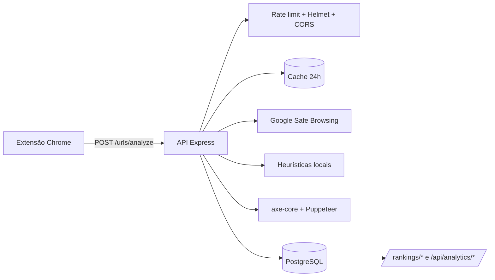

# Sentinela APL — Verificador de Golpes e Auditoria de Acessibilidade

Sentinela é um projeto acadêmico do IFC (Desenvolvimento Web II, Engenharia
de Software I e Projeto Aplicado I) composto por:

- uma **API Node.js / Express 5** que verifica se uma URL é maliciosa e
  audita a acessibilidade da página com [axe-core](https://github.com/dequelabs/axe-core);
- uma **extensão Chrome (Manifest V3)** que dispara essa verificação a cada
  página visitada e bloqueia páginas perigosas com um overlay vermelho;
- um banco **PostgreSQL** que guarda histórico, denúncias, contas e
  rankings de sites.

Protótipo de UI no [Figma](https://www.figma.com/design/cSpctw3HFH3WtnrcE4Sxm0/Prot%C3%B3tipo-Golpe?node-id=0-1&t=G2b8J3uETeqTlqHO-1).

---

## Sumário

- [Como funciona](#como-funciona)
- [Estrutura do repositório](#estrutura-do-repositório)
- [Pré-requisitos](#pré-requisitos)
- [Executando com Docker (recomendado)](#executando-com-docker-recomendado)
- [Executando sem Docker (Node + PostgreSQL locais)](#executando-sem-docker-node--postgresql-locais)
- [Carregando a extensão no Chrome](#carregando-a-extensão-no-chrome)
- [Variáveis de ambiente](#variáveis-de-ambiente)
- [Como testar a API](#como-testar-a-api)
- [Referência da API](#referência-da-api)
- [Scripts NPM disponíveis](#scripts-npm-disponíveis)
- [Testes automatizados](#testes-automatizados)
- [Limitações e issues conhecidas](#limitações-e-issues-conhecidas)
- [Contribuindo](#contribuindo)

---

## Como funciona

Cada vez que o usuário navega para uma página, a extensão dispara uma
requisição `POST /urls/analyze` para a API. A API então:

1. **Cache de segurança (24 h)** — procura no PostgreSQL uma análise recente
   da mesma URL para evitar chamadas externas redundantes.
2. **Google Safe Browsing** — caso seja _cache miss_, consulta a API oficial
   do Google para detectar phishing, malware e engenharia social.
3. **Heurísticas locais** — aplica 7 regras estruturais (IP literal, TLDs de
   baixa reputação, DNS dinâmico, palavras-chave suspeitas, etc.) como
   segunda camada.
4. **axe-core via Puppeteer** — abre a página em um Chromium headless,
   executa o axe e gera uma nota de acessibilidade (0–100).
5. **Persiste** a análise (`url_analyses`) vinculada ao usuário logado,
   quando houver token. A extensão recebe o veredito de segurança e a nota;
   se o site for perigoso, mostra o overlay vermelho bloqueando a página.



> A API é resiliente a quedas do PostgreSQL: o veredito de segurança e a
> nota de acessibilidade continuam sendo devolvidos mesmo com o banco
> indisponível — apenas o histórico fica marcado como não-persistido
> (`persistence.persisted: false`).

---

## Estrutura do repositório

```
verificador_golpe/
├── docker-compose.yml          # API + PostgreSQL prontos para subir
├── .env.example                # Modelo de variáveis (copiar para .env)
├── README.md
│
├── api/                        # Backend Node.js (Express 5)
│   ├── Dockerfile              # node:20-bookworm-slim + Chromium
│   ├── package.json
│   ├── scripts/
│   │   ├── gerarJWT.js         # Gera JWT a partir de um usuário do banco
│   │   ├── simulate-login.js   # Simulação interativa: local | GitHub | Google
│   │   └── test-urls-local.js  # Smoke test de URLs contra a API
│   ├── tests/                  # node:test (unit + integration)
│   │   ├── unit/
│   │   ├── integration/
│   │   ├── fixtures/test-urls.json
│   │   └── helpers/
│   └── src/
│       ├── app.js              # Express, middlewares, rotas
│       ├── server.js           # Bootstrap + shutdown gracioso
│       ├── config/             # database, swagger, oauthProviders
│       ├── controllers/        # verificação, auth, oauth, history, reports, analytics
│       ├── middlewares/        # auth, validação, rate-limit, error handler
│       ├── repositories/       # acesso ao PostgreSQL
│       ├── routes/             # definição das rotas Express
│       ├── services/           # verificationService, axeService, oauthService, ...
│       ├── oauth/              # fetchGithubProfile, fetchGoogleProfile
│       ├── utils/              # heurísticas, jwt, logger, validators, ...
│       └── docs/paths/         # anotações OpenAPI para o Swagger
│
├── extension/                  # Pasta carregada como extensão Chrome
│   ├── manifest.json
│   └── content.js              # Dispara /urls/analyze em cada página
│
├── popup.html                  # ATENÇÃO: ver "Issues conhecidas" abaixo —
├── popup.css                   #   esses 4 arquivos são referenciados pelo
├── popup.js                    #   manifest mas estão na raiz, não em extension/.
├── background.js               #   A extensão NÃO carrega assim sem ajuste.
│
└── db/init/                    # SQL aplicado na 1ª subida do Postgres
    ├── 01-schema.sql           # url_analyses
    ├── 02-auth-history-reports.sql   # users, reports, FK do histórico
    ├── 03-oauth.sql            # oauth_accounts + usuários de teste
    └── 04-axe-analytics.sql    # site_host, quality_rating, axe_source, ...
```

---

## Pré-requisitos

| Ferramenta | Versão | Necessário para |
|---|---|---|
| [Docker](https://www.docker.com/) + Compose v2 | atual | Caminho rápido (API + banco) |
| [Node.js](https://nodejs.org/) | 20+ | Desenvolvimento sem Docker |
| [PostgreSQL](https://www.postgresql.org/) | 16+ | Desenvolvimento sem Docker |
| Chrome ou Chromium | atual | Extensão + axe no host sem Docker |
| Chave [Google Safe Browsing](https://console.cloud.google.com/) | — | Verificação de URLs |
| OAuth App [GitHub](https://github.com/settings/developers) | — | Login social (opcional) |
| OAuth Client [Google](https://console.cloud.google.com/apis/credentials) | — | Login social (opcional) |

---

## Executando com Docker (recomendado)

É a forma mais rápida — Chromium e dependências já vêm prontas dentro do
container da API.

### 1. Copie e preencha o `.env`

```bash
cp .env.example .env
```

Edite o `.env` na raiz e preencha **no mínimo**:

- `GOOGLE_API_KEY` — chave do Google Safe Browsing.
- `JWT_SECRET` — string longa e aleatória.

OAuth (`GITHUB_*` / `GOOGLE_*`) é opcional, mas necessário se você quiser
testar login social pelo `simulate-login` ou pela extensão.

### 2. Suba a API e o banco

```bash
docker compose up --build
```

Para rodar em segundo plano: `docker compose up --build -d`.

> Sempre que mexer em `db/init/*.sql`, derrube o volume antes de subir
> de novo para o Postgres reaplicar os scripts:
> ```bash
> docker compose down -v && docker compose up --build
> ```

### 3. Verifique

```bash
curl http://localhost:3000/api/status
# {"sucesso":true,"mensagem":"API do SentryVZN operando normalmente.", ...}
```

Acesse a documentação interativa: <http://localhost:3000/api/docs>

### Comandos úteis

| Comando | O que faz |
|---|---|
| `docker compose logs -f api` | Logs da API em tempo real |
| `docker compose logs -f db` | Logs do PostgreSQL |
| `docker compose down` | Para os containers |
| `docker compose down -v` | Para e **apaga o volume do banco** |

---

## Executando sem Docker (Node + PostgreSQL locais)

### 1. Configure o PostgreSQL

Suba um Postgres 16 local e aplique os scripts em `db/init/` **na ordem
numérica** (01 → 04). Os scripts criam:

- Tabela `url_analyses` (URLs analisadas + violações axe + pontuação).
- Tabela `users` (auth local + slot para OAuth).
- Tabela `reports` (denúncias dos usuários).
- Tabela `oauth_accounts` (vínculos GitHub/Google).
- 4 usuários de teste — **todos com senha `123456`**: `admin@test.com`,
  `joao@test.com`, `maria@test.com`, e `oauth@test.com` (apenas OAuth, sem
  senha).

### 2. Configure o `.env`

Como o backend usa `dotenv.config()` (sem caminho explícito), ele só
carrega o `.env` que estiver no diretório onde o processo Node foi
iniciado. Em desenvolvimento local **rode o servidor sempre a partir de
`api/`** e coloque o `.env` lá:

```bash
cp .env.example api/.env
```

Edite `api/.env`:

```ini
DB_HOST=localhost                    # No Docker é "db"; sem Docker use "localhost"
PUPPETEER_EXECUTABLE_PATH=C:\Program Files\Google\Chrome\Application\chrome.exe
GOOGLE_API_KEY=sua_chave_aqui
JWT_SECRET=string_longa_aleatoria
```

> Veja [Issues conhecidas](#limitações-e-issues-conhecidas) sobre esse
> comportamento do `dotenv`.

### 3. Suba a API

```bash
cd api
npm install
npm run dev          # nodemon com hot reload
# ou: npm start      # sem reload
```

A API responde em `http://localhost:3000`. Os mesmos endpoints (`/api/status`,
`/api/docs`) funcionam.

---

## Carregando a extensão no Chrome

1. Abra `chrome://extensions/`.
2. Ative o **Modo do desenvolvedor**.
3. Clique em **Carregar sem compactação** e selecione a pasta `extension/`.
4. Com a API rodando em `http://localhost:3000`, navegue para qualquer
   site para disparar a análise.
   - Se a URL for perigosa, um overlay vermelho cobre a página.
   - Se for segura, a nota de acessibilidade aparece no console
     (`F12 → Console`):
     ```
     Sentinela — nota de acessibilidade: 89/100 (2 violações, fonte: server)
     ```

> **Atenção** — a parte que funciona hoje é só o `content.js` (overlay e
> análise automática). O popup do toolbar e o login pela extensão estão
> com arquivos fora de lugar; ver [Issues conhecidas](#limitações-e-issues-conhecidas).

---

## Variáveis de ambiente

Todas vivem no `.env` da raiz (ou em `api/.env` quando o servidor roda
fora do Docker). Confira `.env.example` para o modelo completo.

| Variável | Obrigatório | Descrição |
|---|---|---|
| `PORT` | não (default 3000) | Porta da API |
| `GOOGLE_API_KEY` | **sim** | Google Safe Browsing |
| `JWT_SECRET` | **sim** | Segredo de assinatura dos tokens |
| `JWT_EXPIRES_IN` | não (default `7d`) | Validade do JWT |
| `GITHUB_CLIENT_ID`, `GITHUB_CLIENT_SECRET`, `GITHUB_CALLBACK_URL` | só para OAuth GitHub | Credenciais da OAuth App |
| `GOOGLE_CLIENT_ID`, `GOOGLE_CLIENT_SECRET`, `GOOGLE_CALLBACK_URL` | só para OAuth Google | Credenciais do OAuth Client |
| `OAUTH_SUCCESS_REDIRECT` | recomendado | URL para onde a API redireciona após login OAuth bem-sucedido (com `?token=...`). O default usa `/auth/success` (página própria que copia o JWT). Necessário para a extensão capturar o token. |
| `AXE_ENABLED` | não (default `true`) | `false` desliga a auditoria no servidor |
| `AXE_TIMEOUT_MS` | não (default `45000`) | Timeout de navegação + análise do axe |
| `PUPPETEER_EXECUTABLE_PATH` | sim em host sem Docker | Caminho do Chrome/Chromium |
| `DB_USER`, `DB_PASSWORD`, `DB_HOST`, `DB_NAME`, `DB_PORT` | sim | Conexão PostgreSQL |
| `DB_CONNECT_TIMEOUT_MS`, `DB_IDLE_TIMEOUT_MS` | não | Timeouts do pool `pg` |

> Nunca commite o `.env` real — `.gitignore` já cobre `.env`, `*.env` e
> `api/.env`, exceto `.env.example`.

---

## Como testar a API

Os caminhos abaixo assumem a API rodando em `http://localhost:3000`.

### 1) Health check

```bash
curl http://localhost:3000/api/status
```

### 2) Swagger interativo

Abra <http://localhost:3000/api/docs> no navegador. O JSON OpenAPI fica em
`/api/docs.json`.

### 3) Analisar uma URL (sem login)

```bash
curl -X POST http://localhost:3000/urls/analyze \
  -H "Content-Type: application/json" \
  -d '{"url":"https://example.com"}'
```

### 4) Smoke test em lote

Roda análises contra a fixture `api/tests/fixtures/test-urls.json` (URLs
seguras, suspeitas e inválidas):

```bash
cd api
npm run test:urls
```

### 5) Logar como usuário de teste

Com o servidor de pé, em outro terminal:

```bash
cd api
npm run login:simulate
```

Aparece um menu interativo com três opções:

```
Sentinela — simulação de login
  API alvo: http://localhost:3000
  ----------------------------------------------------------
  [1] LOCAL    — e-mail + senha (registra se não existir)
  [2] GITHUB   — OAuth (configurado | NÃO configurado)
  [3] GOOGLE   — OAuth (configurado | NÃO configurado)
  [0] Sair
```

- **[1] LOCAL** — pede e-mail/senha e tenta `POST /auth/login`; se a conta
  não existir, oferece registrar. Usa qualquer um dos quatro usuários do
  seed (`admin@test.com`, `joao@test.com`, `maria@test.com` — senha
  `123456`).
- **[2] / [3]** — confirma se o provedor está habilitado, abre a URL de
  autorização no navegador e aguarda você colar de volta a URL final do
  callback (ou o JSON, ou só o JWT). O OAuth requer `..._CLIENT_ID`,
  `..._CLIENT_SECRET` e `..._CALLBACK_URL` no `.env`.

Modo não-interativo (CI/scripts):

```bash
npm run login:simulate -- --flow=local --email=foo@bar.com --password=senha123 --name="Foo"
npm run login:simulate -- --flow=github
npm run login:simulate -- --flow=google --no-open --once
```

### 6) Gerar JWT a partir de um usuário do banco

```bash
cd api
npm run jwt                     # lista usuários e pede para escolher
npm run jwt -- --user-id=1      # direto, sem prompt
```

O token é assinado com o `JWT_SECRET` do `.env` — nada hardcoded.

---

## Referência da API

Rotas protegidas usam:

```
Authorization: Bearer <jwt>
```

Documentação completa e schemas em `/api/docs`.

### Health & metadata

| Método | Rota | Auth | Descrição |
|---|---|---|---|
| `GET` | `/` | público | Página de boas-vindas com HATEOAS |
| `GET` | `/api/status` | público | Health check (sempre 200; sinaliza dependências) |
| `GET` | `/api/docs` | público | Swagger UI |
| `GET` | `/api/docs.json` | público | OpenAPI 3 em JSON |

### Autenticação local

| Método | Rota | Body | Resposta |
|---|---|---|---|
| `POST` | `/auth/register` | `{ name, email, password }` | `201` + `{ token, user }` |
| `POST` | `/auth/login` | `{ email, password }` | `200` + `{ token, user }` |

### Autenticação OAuth (GitHub, Google)

O **e-mail é a chave da conta** — autenticar com GitHub e Google usando o
mesmo e-mail unifica tudo em um único `users.id` e um único histórico.

| Método | Rota | Descrição |
|---|---|---|
| `GET` | `/auth/oauth/providers` | Lista provedores configurados no servidor |
| `GET` | `/auth/oauth/github` | Redireciona para autorização GitHub |
| `GET` | `/auth/oauth/google` | Redireciona para autorização Google |
| `GET` | `/auth/oauth/:provider/callback` | Callback — troca o code por JWT |
| `GET` | `/auth/success` | Página de aterrissagem que exibe o JWT com botão "Copiar" + `postMessage` para popups e `chrome.runtime.sendMessage` para a extensão |

O fluxo (válido para os dois provedores) é:

1. `buildAuthorizeUrl` monta `client_id`, `redirect_uri`, `scope` e um
   `state` assinado em JWT (10 min de validade) como CSRF.
2. Provedor redireciona para `/auth/oauth/:provider/callback?code=...&state=...`.
3. API valida o `state`, troca `code` por `access_token` e busca o perfil
   (`/user` no GitHub, `/oauth2/v2/userinfo` no Google).
4. Resolve o usuário por `provider_user_id` → busca por e-mail → cria
   novo (`password_hash = null`) se não existir.
5. Devolve `{ token, user }` em JSON **ou** redireciona para
   `OAUTH_SUCCESS_REDIRECT?token=...`.

### Verificação de URLs

#### `POST /urls/analyze`

Header `Authorization` é **opcional** — quando enviado, vincula a análise
ao histórico do usuário.

```json
{
  "url": "https://exemplo.com/pagina",
  "accessibility_report": [],
  "dev_mode": false
}
```

| Campo | Tipo | Obrigatório | Descrição |
|---|---|---|---|
| `url` | string | sim | URL http(s) |
| `accessibility_report` | array | não | Fallback usado se o axe no servidor falhar |
| `dev_mode` | bool/string | não | Inclui `accessibility.detailed_report` na resposta |

**Resposta (200):**

```json
{
  "analysis_id": 1,
  "security": {
    "is_danger": false,
    "status": "Seguro",
    "reason": "Nenhuma ameaça detectada ...",
    "from_cache": false
  },
  "accessibility": {
    "report_received": true,
    "violations_count": 2,
    "sanitized_violations_stored": 2,
    "passes_count": 48,
    "accessibility_score": 25,
    "quality_rating": 93,
    "axe_source": "server",
    "axe_error": null
  },
  "persistence": { "persisted": true, "error": null },
  "cached": false
}
```

| Métrica | Significado |
|---|---|
| `quality_rating` | 0–100 — **maior = melhor** acessibilidade |
| `accessibility_score` | Penalidade acumulada — maior = pior |
| `passes_count` | Regras de acessibilidade que a página **passou** (usado no amortecimento) |
| `axe_source` | `server` (Puppeteer), `client` (fallback) ou `skipped` |

**Como a nota é calculada (justa por design):**

1. **Penalidade por regra** com pesos por impacto:
   `critical × 10 + serious × 5 + moderate × 2 + minor × 1`.
2. **Retornos decrescentes por nós:** cada regra é multiplicada por `1 + log2(nós)`
   (com teto), então repetir o mesmo problema em dezenas de elementos pesa cada
   vez menos — uma única regra não zera o site.
3. **Curva exponencial:** `quality_rating = 100 · e^(-penalidade/150)`. A nota
   cai suavemente e nunca chega a zero "no grito"; só tende a zero em páginas
   realmente catastróficas.
4. **Amortecimento por cobertura:** quando o axe informa quantas regras a página
   passou (`passes_count`), a penalidade é descontada proporcionalmente — sites
   que acertam a maioria das verificações recebem uma nota mais clemente.

**Status de segurança possíveis:**

| Status | Significado |
|---|---|
| `GOLPE CONFIRMADO` | Google Safe Browsing reportou ameaça |
| `Aparência Suspeita (Heurística)` | Regra local disparou |
| `Erro de Formato` | URL inválida ou ilegível |
| `Seguro` | Sem ameaça detectada |

#### Heurísticas locais (segunda camada)

Aplicadas quando o Safe Browsing não encontra nada. Qualquer regra
positiva já marca como `Aparência Suspeita (Heurística)`:

| Regra | Detalhe |
|---|---|
| IP literal | Hostname é IPv4 (ex.: `http://192.168.0.1/login`) |
| Excesso de hífens | 3+ hífens no hostname |
| TLD baixa reputação | `.tk .ml .ga .cf .gq .xyz .top .pw` |
| DNS dinâmico / túnel | `ngrok.io`, `duckdns.org`, `noip.com`, `ddns.net`, `serveo.net`, `localtunnel.me` |
| Palavras-chave | `login`, `secure`, `account`, `update`, `banking`, `verify`, `free`, `admin`, `password`, `recover` |
| Subdomínios excessivos | 5+ segmentos no hostname |
| URL muito longa | Mais de 200 caracteres |

### Histórico, denúncias e rankings

| Método | Rota | Auth | Descrição |
|---|---|---|---|
| `GET` | `/users/history?limit&offset&url` | **sim** | Histórico do usuário (paginado; `limit` máx. 100) |
| `GET` | `/urls/scores/history?url=...` | público | Timeline de notas de uma URL (até 100 entradas) |
| `POST` | `/reports` | **sim** | Envia denúncia (`{ url, analysis_id?, report_type, comment? }`) |
| `GET` | `/rankings/accessibility/worst?limit&min_analyses` | público | Sites com piores `quality_rating` médio |
| `GET` | `/rankings/accessibility/best?limit&min_analyses` | público | Sites com melhores `quality_rating` médio |
| `GET` | `/rankings/reports/most?limit` | público | Sites mais denunciados |

`report_type` aceita: `false_positive`, `confirmed_scam`,
`accessibility_issue`, `other`.

### Analytics (autenticado)

Endpoints agregados para dashboards. Todos exigem JWT.

| Rota | O que retorna |
|---|---|
| `GET /api/analytics/security/global` | Volumetria total de análises, ameaças e cache hits |
| `GET /api/analytics/security/community` | Estatísticas de denúncias cruzadas com origem da análise |
| `GET /api/analytics/security/ranking/hosts?limit` | Hosts com mais análises perigosas |
| `GET /api/analytics/accessibility/global` | Médias globais de `quality_rating` e contagem por `axe_source` |
| `GET /api/analytics/accessibility/ranking/hosts?limit` | Hosts com pior média de acessibilidade |

---

## Scripts NPM disponíveis

Todos rodam dentro de `api/`.

| Comando | O que faz |
|---|---|
| `npm start` | `node src/server.js` (produção / Docker) |
| `npm run dev` | `nodemon` com hot reload |
| `npm test` | Testes unit + integration via `node --test` |
| `npm run test:unit` | Apenas testes unitários |
| `npm run test:integration` | Apenas integração (supertest contra a app em memória) |
| `npm run test:urls` | Smoke test contra a API rodando (fixtures de URL) |
| `npm run jwt` | Gera JWT — lista usuários e pergunta qual usar |
| `npm run jwt -- --user-id=1` | Gera JWT direto, sem prompt |
| `npm run login:simulate` | Menu interativo: local / GitHub / Google |

Na raiz:

| Comando | O que faz |
|---|---|
| `docker compose up --build` | Sobe API + PostgreSQL |
| `docker compose down -v` | Derruba e apaga o volume do banco |

---

## Testes automatizados

```bash
cd api
npm install
npm test
```

Hoje existem **13 suítes / 58 testes unitários** + uma suíte de integração:

| Suíte | O que cobre |
|---|---|
| `accessibilityScore` | Pontuação ponderada por impacto e `quality_rating` |
| `axeDetailedReport` | `dev_mode` e formatação detalhada das violações |
| `urlHeuristics` | 7 regras heurísticas + URLs inválidas |
| `validators` | Validação de URLs HTTP/HTTPS |
| `verificationServiceResilience` | Quedas de cache/persistência no Postgres |
| `oauthState` | CSRF do OAuth (state + nonce) |
| `oauthProviders` | Resolução de credenciais por env e listagem |
| `oauthBuildAuthorize` | Montagem da URL de autorização (precisa de `jsonwebtoken`) |
| `oauthExchangeToken` | Troca de `code` por `access_token` (precisa de `jsonwebtoken`) |
| `oauthHandleCallback` | Fluxo de callback ponta-a-ponta (precisa de `jsonwebtoken`) |
| `oauthProfileFetchers` | Leitura de perfil GitHub/Google com `fetch` mockado |
| `authServiceLocal` | Registro, login, senha errada, conta OAuth sem senha |
| `oauthServiceFlow` | Simulação completa GitHub e Google (state, exchange, perfil, criação/unificação, JWT) — usa `moduleStubs` para rodar sem deps |
| `tests/integration/api.routes.test.js` | Smoke test das rotas (supertest) |

> Três suítes (`oauthBuildAuthorize`, `oauthExchangeToken`,
> `oauthHandleCallback`) requerem `jsonwebtoken` real e portanto exigem
> `npm install`. As outras usam `tests/helpers/moduleStubs.js` para
> stub-ar `bcrypt`, `jsonwebtoken`, `pg`, `puppeteer-core` e `fetch`.

Smoke test contra a API em execução:

```bash
npm run test:urls
# Fixtures em api/tests/fixtures/test-urls.json
```

---

## Limitações e issues conhecidas

Pontos importantes para quem vai testar/contribuir:

1. **Popup da extensão está em arquivos soltos na raiz.**
   `extension/manifest.json` referencia `popup.html`, `popup.css`,
   `popup.js` e `background.js` como se fossem irmãos dele, mas esses
   quatro arquivos estão na **raiz do projeto**. Carregar `extension/` no
   Chrome _sem ajustar_ deixa o popup, o background service worker e o
   login-via-extensão sem funcionar — apenas o `content.js` (overlay +
   chamada à API) opera. Para testar o popup, copie/mova os arquivos para
   dentro de `extension/` antes de carregar.
2. **`popup.js` aponta para rotas inexistentes.** O botão "Login com
   Google" chama `${API_URL}/auth/google` (a rota correta é
   `/auth/oauth/google`); a aba "Ranking Global" chama `/rankings` (não
   existe — use `/rankings/accessibility/worst|best` ou `/rankings/reports/most`).
3. **`dotenv` carrega `.env` do `cwd` do processo Node.** O `.env`
   canônico fica na raiz, mas o `api/src/app.js` faz só
   `require('dotenv').config()`, então em execução local (`cd api && npm
   run dev`) ele procura por `api/.env`. Soluções: rodar via Docker (que
   já injeta o `.env` da raiz com `env_file`), copiar o `.env` para
   `api/.env`, ou exportar as variáveis na sessão.
4. **`.env.example` tem `OAUTH_SUCCESS_REDIRECT` duplicado** (comentado
   em uma linha, depois descomentado com outro valor). Quando for
   preencher, use só a entrada ativa (`http://localhost:3000/auth/success`).
5. **Histórico na UI:** a API expõe `/users/history` e
   `/urls/scores/history`, mas a extensão ainda não consome essas rotas
   de forma estável.
6. **Modo degradado (Postgres fora):** análises continuam sendo
   devolvidas (com `persistence.persisted: false`), mas **não entram no
   histórico** quando o banco volta — não há replay automático.
7. **`dev_mode: true` traz HTML cru** das páginas auditadas. Usar só em
   desenvolvimento.
8. **Sem Docker, o Puppeteer precisa de um Chrome/Chromium** instalado
   no host com `PUPPETEER_EXECUTABLE_PATH` apontando para o binário.

---

## Contribuindo

1. Faça uma branch a partir de `main`.
2. Aplique a mudança em escopo limitado (API + extensão + testes
   relevantes).
3. Rode `cd api && npm test` antes de abrir o PR.
4. Descreva no PR o que mudou e como validar.

## Licença

ISC (conforme `api/package.json`). Ajuste conforme a política do projeto
acadêmico.

## Equipe

Projeto integrador das matérias de Desenvolvimento Web II, Engenharia de
Software I e Projeto Aplicado I — IFC. Repositório:
[github.com/Victor-Casagrande/verificador_golpe](https://github.com/Victor-Casagrande/verificador_golpe).
