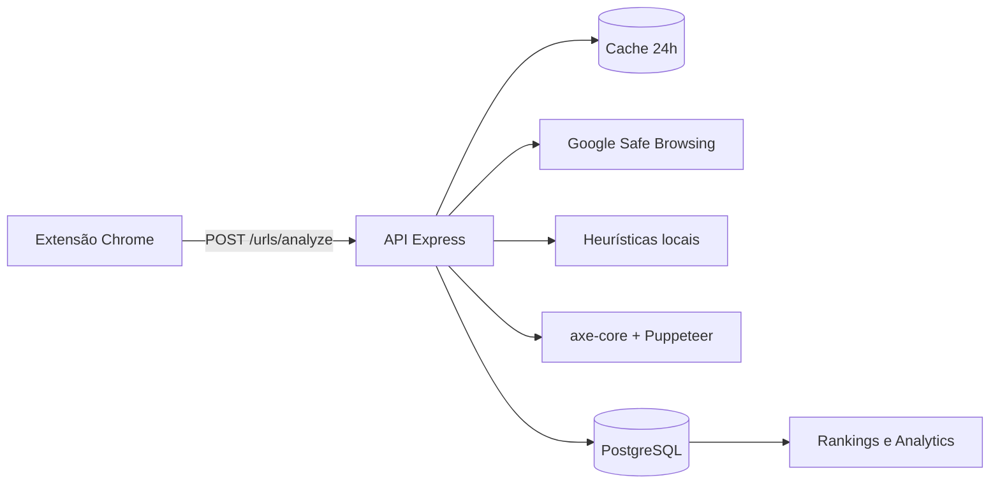

# Sentinela APL — Verificador de Golpes e Auditoria de Acessibilidade

Projeto acadêmico integrador (IFC — Desenvolvimento Web II, Engenharia de Software I e Projeto Aplicado I) que combina **verificação de segurança de URLs**, **auditoria de acessibilidade web** e **participação comunitária** em uma plataforma completa.

Protótipo de UI: [Figma](https://www.figma.com/design/cSpctw3HFH3WtnrcE4Sxm0/Prot%C3%B3tipo-Golpe?node-id=0-1&t=G2b8J3uETeqTlqHO-1)

---

## Autores

| Grupo Sentinela APL            |
| ------------------------------ |
| **Victor Casagrande**          |
| **Lucas Duarte Lopes**         |
| **Matheus Trombetta Degaraes** |
| **Willighan Tinelli de Souza** |

Repositório: [github.com/Victor-Casagrande/verificador_golpe](https://github.com/Victor-Casagrande/verificador_golpe)

Licenciado sob [GNU GPL v3.0](LICENSE).

---

## O que o Sentinela faz

O Sentinela protege o usuário durante a navegação e avalia a qualidade de acessibilidade dos sites visitados.

| Componente                  | Papel                                                                                                        |
| --------------------------- | ------------------------------------------------------------------------------------------------------------ |
| **Extensão Chrome (MV3)**   | Analisa cada página visitada, bloqueia sites perigosos com overlay vermelho e exibe a nota de acessibilidade |
| **API Node.js / Express**   | Orquestra verificação de segurança, auditoria axe-core e persistência de dados                               |
| **Frontend React (Vercel)** | Dashboard com histórico, rankings e analytics                                                                |
| **PostgreSQL**              | Histórico de análises, contas, denúncias e agregações                                                        |

---

## Funcionalidades

### Verificação de segurança

Cada URL passa por três camadas, nesta ordem:

1. **Cache de 24 horas** — reutiliza análises recentes da mesma URL.
2. **Google Safe Browsing** — detecta phishing, malware e engenharia social.
3. **Heurísticas locais** — sete regras estruturais quando o Google não reporta ameaça:

| Regra                    | O que sinaliza                                           |
| ------------------------ | -------------------------------------------------------- |
| IP literal no hostname   | URLs com endereço numérico direto                        |
| Excesso de hífens        | 3 ou mais hífens no domínio                              |
| TLD de baixa reputação   | `.tk`, `.ml`, `.ga`, `.cf`, `.gq`, `.xyz`, `.top`, `.pw` |
| DNS dinâmico / túnel     | `ngrok.io`, `duckdns.org`, `noip.com`, `ddns.net`, etc.  |
| Palavras-chave suspeitas | `login`, `secure`, `banking`, `verify`, `password`, etc. |
| Subdomínios excessivos   | 5 ou mais segmentos no hostname                          |
| URL muito longa          | Mais de 200 caracteres                                   |

**Status possíveis:** `GOLPE CONFIRMADO` · `Aparência Suspeita (Heurística)` · `Erro de Formato` · `Seguro`

### Auditoria de acessibilidade

A API abre a página em Chromium headless e executa [axe-core](https://github.com/dequelabs/axe-core). O resultado inclui:

| Campo                 | Significado                                                        |
| --------------------- | ------------------------------------------------------------------ |
| `quality_rating`      | Nota de 0 a 100 — **maior = melhor**                               |
| `accessibility_score` | Penalidade acumulada — **maior = pior**                            |
| `passes_count`        | Regras que a página passou (usado no cálculo da nota)              |
| `violations_count`    | Quantidade de violações encontradas                                |
| `axe_source`          | `server` (Puppeteer), `client` (fallback da extensão) ou `skipped` |

**Modelo de pontuação** (projetado para não punir injustamente sites grandes):

- Pesos por impacto: critical × 10, serious × 5, moderate × 2, minor × 1.
- Retornos decrescentes por repetição da mesma regra (`1 + log₂(nós)`, com teto).
- **Curva exponencial:** a nota final é calculada por

  `quality_rating = 100 × e^(-penalidade_efetiva / 150)`

  onde `penalidade_efetiva` é a penalidade acumulada (ajustada pelo amortecimento de cobertura). Com penalidade zero a nota é 100; conforme as violações aumentam, a nota decai de forma suave — nunca cai abruptamente a zero, mesmo em páginas com muitos problemas.

- Amortecimento por cobertura: páginas que passam na maioria das regras recebem nota mais clemente.

### Contas e autenticação

- Registro e login com **e-mail e senha**.
- Login social via **GitHub** e **Google**.
- **Contas unificadas por e-mail** — o mesmo endereço em provedores diferentes vincula-se a um único histórico.
- JWT com revogação em logout (blacklist).

### Histórico, denúncias e rankings

- Histórico pessoal de análises (autenticado).
- Timeline pública de notas por URL.
- Denúncias com tipos: `false_positive`, `confirmed_scam`, `accessibility_issue`, `other`.
- Rankings públicos: melhores/piores sites em acessibilidade e sites mais denunciados.
- Analytics agregados (autenticado): volumetria de ameaças, cache hits, médias globais de acessibilidade.

---

## Fluxo de análise



A extensão envia `POST /urls/analyze` a cada navegação. Se o site for perigoso, um overlay vermelho bloqueia a página. Se for seguro, a nota de acessibilidade aparece no console do navegador.

---

## Peculiaridades e comportamento esperado

| Comportamento            | Descrição                                                                                                                                                                |
| ------------------------ | ------------------------------------------------------------------------------------------------------------------------------------------------------------------------ |
| **Resiliência ao banco** | Se o PostgreSQL estiver indisponível, a análise de segurança e acessibilidade **continua funcionando** — apenas o histórico não é salvo (`persistence.persisted: false`) |
| **Cache de segurança**   | Resultados de Safe Browsing/heurísticas são reutilizados por 24 h                                                                                                        |
| **`dev_mode`**           | Inclui relatório detalhado das violações axe (respostas muito grandes — usar só em desenvolvimento)                                                                      |
| **Análise sem login**    | `POST /urls/analyze` funciona sem JWT; com token, vincula ao histórico do usuário                                                                                        |
| **Extensão**             | O `content.js` analisa automaticamente cada página; popup/login da extensão ainda em desenvolvimento                                                                     |

---

## Instalação e execução

### Pré-requisitos

| Ferramenta                                                      | Versão | Necessário para                     |
| --------------------------------------------------------------- | ------ | ----------------------------------- |
| [Git](https://git-scm.com/)                                     | atual  | Clonar o repositório                |
| [Docker](https://www.docker.com/) + Compose v2                  | atual  | Caminho recomendado (API + banco)   |
| [Node.js](https://nodejs.org/)                                  | 20+    | Execução sem Docker                 |
| [PostgreSQL](https://www.postgresql.org/)                       | 16+    | Execução sem Docker                 |
| Chrome ou Chromium                                              | atual  | Extensão e auditoria axe sem Docker |
| Chave [Google Safe Browsing](https://console.cloud.google.com/) | —      | Análise de URLs                     |

OAuth (GitHub/Google) e frontend são opcionais.

### 1. Clonar o repositório

```bash
git clone https://github.com/Victor-Casagrande/verificador_golpe.git
cd verificador_golpe
```

### 2. Configurar variáveis de ambiente

```bash
cp .env.example .env
```

Edite `.env` na **raiz do projeto** e preencha no mínimo:

- `GOOGLE_API_KEY` — chave da API Google Safe Browsing
- `JWT_SECRET` — string longa e aleatória

OAuth (`GITHUB_*`, `GOOGLE_*`) só é necessário para testar login social.

---

### Opção A — Com Docker (recomendado)

Sobe a **API** e o **PostgreSQL** com um comando. O Chromium já vem na imagem.

```bash
docker compose up --build
```

Em segundo plano:

```bash
docker compose up --build -d
```

| Recurso      | URL                                 |
| ------------ | ----------------------------------- |
| Health check | http://localhost:3000/api/status    |
| Swagger UI   | http://localhost:3000/api/docs      |
| OpenAPI JSON | http://localhost:3000/api/docs.json |

**Comandos úteis**

| Comando                      | O que faz                |
| ---------------------------- | ------------------------ |
| `docker compose logs -f api` | Logs da API              |
| `docker compose down`        | Para os containers       |
| `docker compose down -v`     | Para e **apaga o banco** |

> Após alterar scripts em `db/init/`, recrie o volume: `docker compose down -v && docker compose up --build`

**Testar uma análise**

```bash
curl -X POST http://localhost:3000/urls/analyze \
  -H "Content-Type: application/json" \
  -d '{"url":"https://example.com"}'
```

---

### Opção B — Sem Docker

Requer Node.js, PostgreSQL e Chrome/Chromium instalados localmente.

#### B.1 — Banco de dados

Crie um banco PostgreSQL 16 e aplique os scripts de `db/init/` **na ordem numérica** (`01` → `06`):

```bash
psql -U postgres -c "CREATE DATABASE sentinela;"
psql -U postgres -d sentinela -f db/init/01-schema.sql
psql -U postgres -d sentinela -f db/init/02-auth-history-reports.sql
psql -U postgres -d sentinela -f db/init/03-oauth.sql
psql -U postgres -d sentinela -f db/init/04-axe-analytics.sql
psql -U postgres -d sentinela -f db/init/05-blacklist-cleanup-extensions.sql
psql -U postgres -d sentinela -f db/init/06-accessibility-score-numeric.sql
```

Usuários de teste criados pelo seed (`03-oauth.sql`), senha **`123456`**:

| E-mail           | Uso           |
| ---------------- | ------------- |
| `admin@test.com` | Admin         |
| `joao@test.com`  | Usuário comum |
| `maria@test.com` | Usuário comum |

#### B.2 — API

```bash
cd api
cp ../.env.example .env
```

Ajuste `api/.env` para ambiente local:

```ini
DB_HOST=localhost
DB_PORT=5432
PUPPETEER_EXECUTABLE_PATH=C:\Program Files\Google\Chrome\Application\chrome.exe
```

> No Linux/macOS, use o caminho do Chromium instalado no sistema (ex.: `/usr/bin/chromium`).

```bash
npm install
npm run dev        # desenvolvimento (hot reload)
# ou: npm start    # produção local
```

A API responde em http://localhost:3000.

---

### Frontend (opcional)

Dashboard React para histórico, rankings e analytics.

```bash
cd frontend
cp .env.example .env
npm install
npm run dev
```

Abre em http://localhost:5173. Confirme que `VITE_API_BASE_URL` aponta para a API (`http://localhost:3000`).

---

### Extensão Chrome (opcional)

1. Abra `chrome://extensions/`
2. Ative **Modo do desenvolvedor**
3. **Carregar sem compactação** → selecione a pasta `extension/`
4. Com a API rodando, navegue em qualquer site

Comportamento:

- Site **perigoso** → overlay vermelho bloqueia a página
- Site **seguro** → nota de acessibilidade no console (`F12 → Console`)

---

### Verificar se tudo funciona

```bash
# Health check
curl http://localhost:3000/api/status

# Análise de URL
curl -X POST http://localhost:3000/urls/analyze \
  -H "Content-Type: application/json" \
  -d '{"url":"https://example.com"}'

# Login com usuário de teste (sem Docker)
curl -X POST http://localhost:3000/auth/login \
  -H "Content-Type: application/json" \
  -d '{"email":"admin@test.com","password":"123456"}'
```

Smoke test em lote (API rodando):

```bash
cd api && npm run test:urls
```

---

## Variáveis de ambiente

Consulte `.env.example` para a lista completa. Principais:

| Variável                | Obrigatório | Função                                 |
| ----------------------- | ----------- | -------------------------------------- |
| `GOOGLE_API_KEY`        | sim         | Google Safe Browsing                   |
| `JWT_SECRET`            | sim         | Assinatura dos tokens de sessão        |
| `DB_*`                  | sim         | Conexão PostgreSQL                     |
| `GITHUB_*` / `GOOGLE_*` | OAuth       | Login social                           |
| `AXE_ENABLED`           | não         | Desativa auditoria Puppeteer (`false`) |
| `CORS_ALLOWED_ORIGINS`  | produção    | Domínios autorizados a consumir a API  |
| `VITE_API_URL`          | frontend    | URL da API na Vercel                   |

> **Produção:** Frontend na Vercel, API no Render, banco no Supabase (porta `6543` com PgBouncer). Docker local usa porta `5432`.

---

## Referência da API

Documentação interativa completa em **`/api/docs`**.

Rotas protegidas exigem `Authorization: Bearer <jwt>`.

### Sistema

| Método | Rota          | Descrição      |
| ------ | ------------- | -------------- |
| `GET`  | `/`           | Índice HATEOAS |
| `GET`  | `/api/status` | Health check   |
| `GET`  | `/api/docs`   | Swagger UI     |

### Autenticação

| Método | Rota                              | Descrição                    |
| ------ | --------------------------------- | ---------------------------- |
| `POST` | `/auth/register`                  | Cadastro local               |
| `POST` | `/auth/login`                     | Login local                  |
| `GET`  | `/auth/oauth/providers`           | Provedores OAuth disponíveis |
| `GET`  | `/auth/oauth/{github\|google}`    | Inicia login social          |
| `GET`  | `/auth/oauth/{provider}/callback` | Callback OAuth → JWT         |

### Verificação e histórico

| Método | Rota                        | Auth     | Descrição                                     |
| ------ | --------------------------- | -------- | --------------------------------------------- |
| `POST` | `/urls/analyze`             | opcional | Análise completa (segurança + acessibilidade) |
| `GET`  | `/users/history`            | sim      | Histórico do usuário                          |
| `GET`  | `/urls/scores/history?url=` | público  | Evolução de notas de uma URL                  |
| `POST` | `/reports`                  | sim      | Enviar denúncia                               |
| `GET`  | `/reports/mine`             | sim      | Denúncias do usuário                          |

### Rankings (públicos)

| Método | Rota                            | Descrição                      |
| ------ | ------------------------------- | ------------------------------ |
| `GET`  | `/rankings/accessibility/worst` | Piores notas médias por host   |
| `GET`  | `/rankings/accessibility/best`  | Melhores notas médias por host |
| `GET`  | `/rankings/reports/most`        | Sites mais denunciados         |

### Analytics (autenticado)

| Método | Rota                                         | Descrição                                |
| ------ | -------------------------------------------- | ---------------------------------------- |
| `GET`  | `/api/analytics/security/global`             | Volumetria de ameaças e cache            |
| `GET`  | `/api/analytics/security/community`          | Denúncias cruzadas com origem da análise |
| `GET`  | `/api/analytics/security/ranking/hosts`      | Hosts mais perigosos                     |
| `GET`  | `/api/analytics/accessibility/global`        | Médias globais de acessibilidade         |
| `GET`  | `/api/analytics/accessibility/ranking/hosts` | Hosts com pior acessibilidade            |

---

## Testes

```bash
cd api && npm install && npm test
```

Smoke test contra API em execução: `npm run test:urls`

---

## Licença

Este projeto é software livre licenciado sob a **[GNU General Public License v3.0 (GPL-3.0)](https://www.gnu.org/licenses/gpl-3.0.html)** ou, a seu critério, qualquer versão posterior.

**Copyright © 2024–2026** — Victor Casagrande, Lucas Duarte Lopes, Matheus Trombetta Degaraes e Willighan Tinelli de Souza.

### O que isso significa

| Permissão                          | Condição                                              |
| ---------------------------------- | ----------------------------------------------------- |
| Usar, estudar e modificar o código | Livremente                                            |
| Redistribuir cópias                | Deve incluir o texto completo da GPL e o código-fonte |
| Distribuir versões modificadas     | Deve permanecer sob GPL e indicar as alterações       |

O texto integral da licença está em [`LICENSE`](LICENSE) na raiz do repositório.

> **Dependências de terceiros** (Node.js, React, axe-core, Puppeteer, etc.) possuem licenças próprias — consulte `package-lock.json` de cada pacote.
